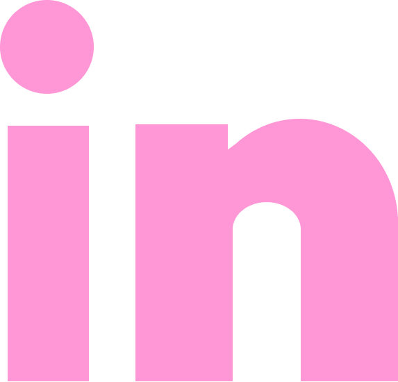

Hi I'm Mar and I build experiences.

find out more about me by checking out my <a href="https://mtisby.github.io/portfolio">portfolio</a> site.

<h1>Languages</h1>

  

<h1>My Stats</h1>

  

    
  

<h1>Contact Me</h1>

  <a href="mailto:mtisby@uci.edu">
     
    
 mtisby@uci.edu 

  </a>
  <a href="https://www.linkedin.com/in/mtisby/">
    
    
 LinkedIn 

  </a>
  <a href="https://mtisby.github.io/portfolio/">
    
    
 Website 

  </a>

